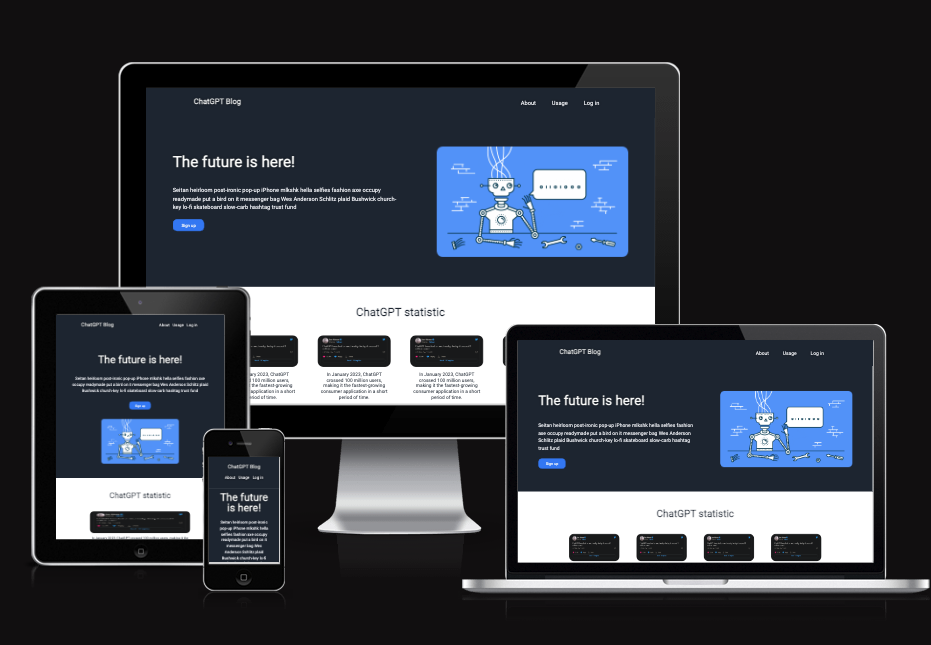
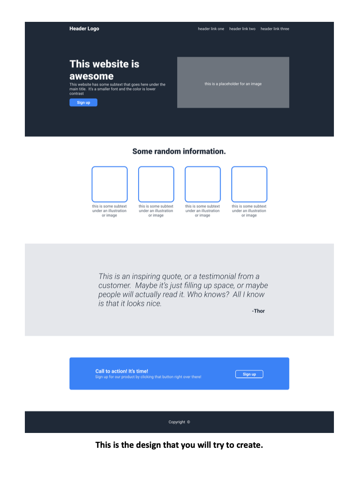

chatgptLandingpage
#Landing page  about chatGPT

# Landing page about chatGPT.

<picture>
 <source media="(prefers-color-scheme: light)" srcset="YOUR-LIGHTMODE-IMAGE">
 
</picture>

 

# Visit the website:   https://kerry-space.github.io/chatgptLandingpage/index.html#about
 
 

# How we Deployed our website

* ## chatgptLandingpage Repository

* ## Deploy the repository to github Page

 
 

# Client Order.
<picture>
 <source media="(prefers-color-scheme: light)" srcset="YOUR-LIGHTMODE-IMAGE">
 
</picture>

 
 

# Used Technologies
##  Discord
  We used discord as our communiton.
---

---

##  Google fontsize

Using google robot font size

---

 
 

# programing langage 
##  HTML
## CSS

Using github to store our code in repsotiory

---

 

# Testing code
* W3C Html Checker
* W3C CSS Validator Results

 
 

#  Lighhouse checker 

* Performance   speed which website  upload and shows on the browser 
* Accsessbillity   for disabilie people to navigate website
* Best pratice   has to do with how it carry out a task or configure.
* SEO   Optimise for search engine, to improve traffic visit to website

 
 

# Our Participant who contributet to development of the website
* kerry Jalal
* Israel Aguilar 
* Darija Krolo
* David Ivankov
* Edidiong N Dan